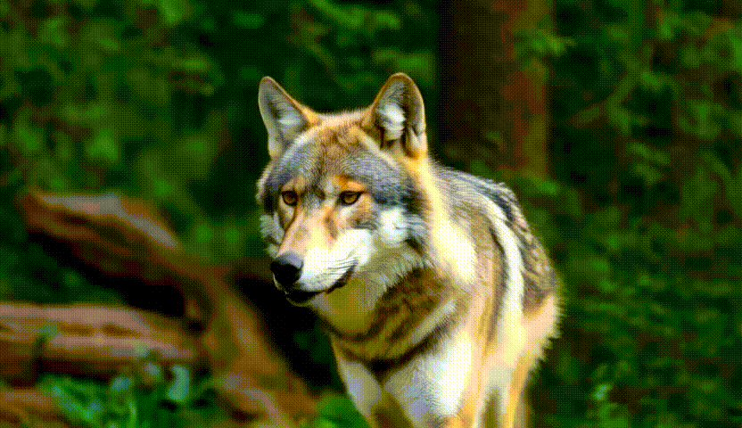
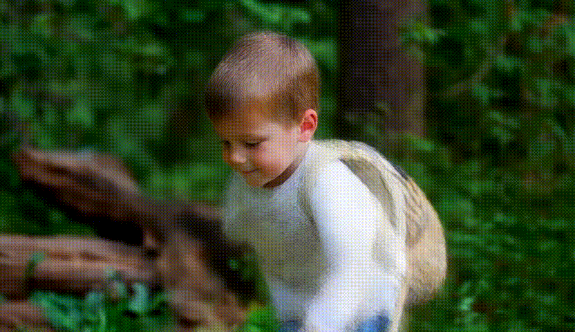
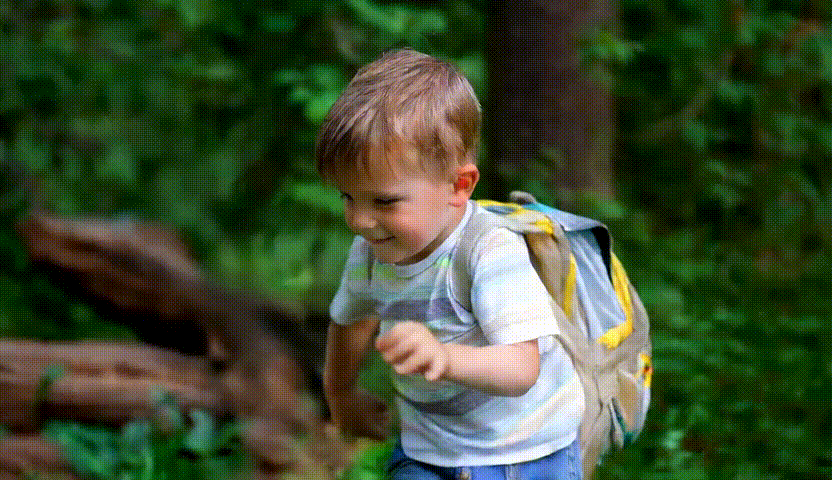
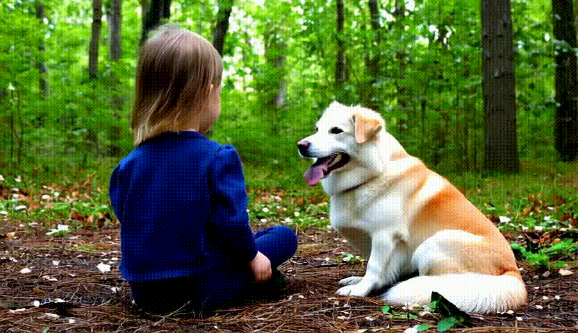
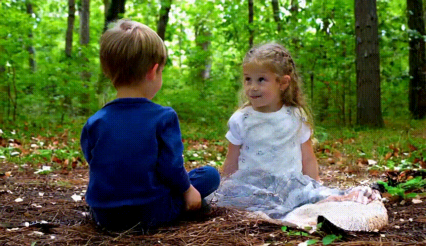
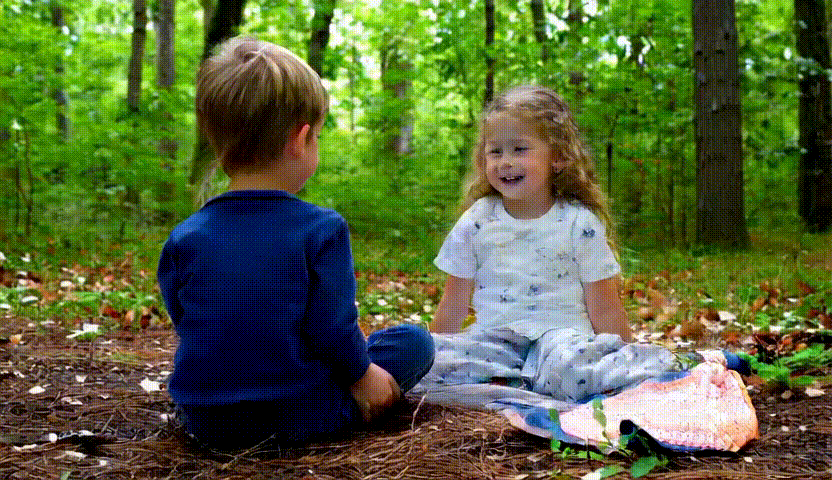
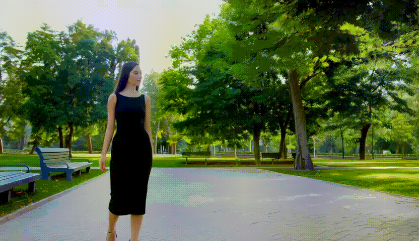
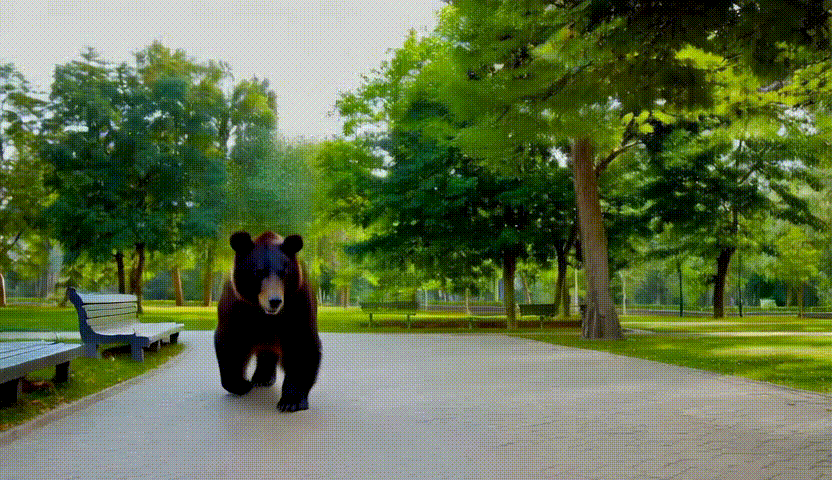
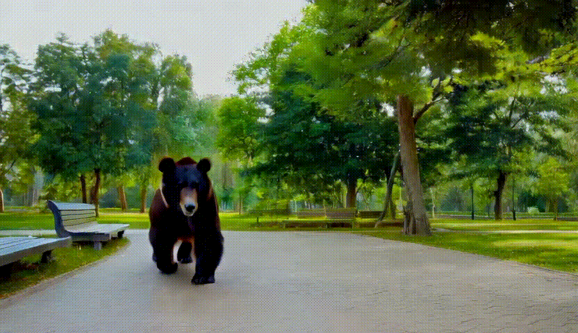

# Video Editing of Subjects with Large Differences

This repository extends [Flow Director](https://github.com/Westlake-AGI-Lab/FlowDirector) with a **simple yet effective fix** of the noise schedule. This method addresses a key limitation in current video editing pipelines — **flickering and unstable reconstruction when performing edits with large object size changes**, such as replacing a large animal with a small human.


## Motivation

Current video editing methods focus on editing with subjects similar to the original subject in size and motion style. However, no work is done to explicitly address editing in scenarios where large modifications are needed, or edits involving large spatial and structural changes. We observed that the standard Flow Director **introduces flickering in newly revealed backgrounds and incomplete editing** under large subject edits.

### Our Contribution

We propose **fixing the added noise during the last _k_ denoising steps**. This small change leads to:

- Smoother background reconstructions  
- Complete editing that successfully erases the original subject
- A noticeable reduction in flickering and distortion  


## Comparison Examples

### 🐺 Example 1: Grey Wolf → Boy

| Original Input | Vanilla Flow Director | Fixed Late Noise |
|----------------|------------------------|---------------------------|
|  |  |  |

### 🐉 Example 2: Dog → Boy

| Original Input | Vanilla Flow Director | Fixed Late Noise |
|----------------|------------------------|---------------------------|
|  |  |  |

We noticed the issue of the girl (left) dog (right) was edited into boy (left) girl (right). This could be due to the diffusion model’s attention maps failing to maintain consistent spatial-role associations in multi-subject scenarios.

### 🐘 Example 3: Woman → Bear

| Original Input | Vanilla Flow Director | Fixed Late Noise |
|----------------|------------------------|---------------------------|
|  |  |  |

---

## 🚀 Usage

```bash
bash script_single_gen.sh
```
For single video editing

```bash
bash script_multiple_gen.sh
```
For multi-video editing
